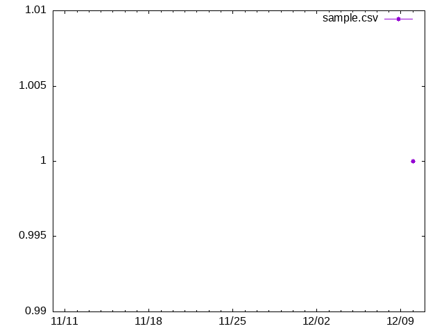

<!-- START doctoc generated TOC please keep comment here to allow auto update -->
<!-- DON'T EDIT THIS SECTION, INSTEAD RE-RUN doctoc TO UPDATE -->
**Table of Contents**

- [サンプル](#%E3%82%B5%E3%83%B3%E3%83%97%E3%83%AB)
  - [理想状態](#%E7%90%86%E6%83%B3%E7%8A%B6%E6%85%8B)
  - [現状の状態](#%E7%8F%BE%E7%8A%B6%E3%81%AE%E7%8A%B6%E6%85%8B)
  - [最新コミット](#%E6%9C%80%E6%96%B0%E3%82%B3%E3%83%9F%E3%83%83%E3%83%88)

<!-- END doctoc generated TOC please keep comment here to allow auto update -->

# サンプル

## 理想状態

- これはサンプルです
- ○○できる状態

## 現状の状態
- これはサンプルです
- ○○はできるが■■はできない
## 最新コミット
- [d9d58e0](https://github.com/bashiiko/self-versioning-template/commit/d9d58e0) 2021-12-11 : サンプルファイル追加
- [d9d58e0](https://github.com/bashiiko/self-versioning-template/commit/d9d58e0) 2021-12-11 : サンプルファイル追加
- [d9d58e0](https://github.com/bashiiko/self-versioning-template/commit/d9d58e0) 2021-12-11 : サンプルファイル追加
